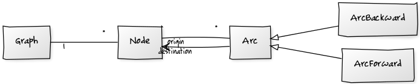
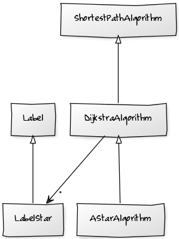
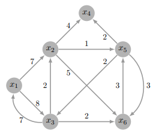

# BE Graphes INSA Toulouse
27/05/2018

## Auteurs

3 MIC C

* Sylvain Dupouy
* Léo Picou

## Introduction

Ce bureau d'étude regroupe à la fois la pratique d'un langage orienté objet (Java) ainsi que l'implémentation d'algorithmes relevant de la théorie des graphes. Le projet initial est disponible [ici](https://gitea.typename.fr/INSA/be-graphes). Les fonctionnalités implémentées sont :
* L'algorithme de Dijkstra
* L'algorithme A* (en version Dijkstra)
* Un algorithme de résolution du problème d'échange de colis
* Des tests de validité concernant Dijkstra et A*
* Des tests de performance concernant Dijkstra et A*

## Conception

### Structures de données

Voici un diagramme UML très simpliste des relations entre structures de données d'un graphe utilisées dans ce projet :

Cette organisation se rapproche d'une liste d'adjacence puisqu'elle permet depuis un noeud de connaître ses successeurs en traversant ses arcs.

### Dijkstra

`DijkstraAlgorithm` utilise des `Label` pour associer à chaque `Node` un coût. Ces `Label` implémentent `Comparable<Label>` et on peut donc les ordonner en fonction de leur côut afin qu'à chaque itération, on récupère le `Label` (et donc le `Node`) de moindre coût non-traité. L'ordonnancement se fait via un tas binaire (classe `BinaryHeap`). Cette structure de données est particulièrement adaptée à Dijkstra puisque l'extraction de l'élément de coût minimal se fait en  compléxité O(log(n)).

Nous avons choisi de découper l'implémentation de l'algorithme en deux méthodes : `step()` et `doRun()` :

* `step()` : Cette méthode va effectuer une itération de l'algorithme et retourner le `Node` qui a été choisi comme minimum pendant cette itération ou bien `null` si l'algorithme est terminé. Nous l'avons extraite de la méthode `doRun()` et définie comme publique afin de pouvoir contrôler l'algorithme au pas à pas, ce qui nous sera utile lors de la résolution du problème ouvert d'échange de colis.
* `doRun()` : Cette méthode se doit d'être implémentée pour les implémentations d'`AbstractAlgorithm`. Elle contient la boucle principale de l'algorithme dans laquelle sera appelée `step()` et renvoie la solution de l'algorithme.  

Lorsque la destination du `ShortestPathData` de l'algorithme est égale à `null`, l'algorithme se terminera uniquement lorsque son tas binaire sera vide. Cela permet de connaître au besoin les coûts minimaux de tous les sommets atteignables depuis l'origine.

### A*-like Dijkstra

Notre implémentation de l'algorithme A* est basée sur Dijkstra. La seule différence réside dans les `Label` utilisés. Cet algorithme utilise des `LabelStar` à la place de simples `Label`. Ceux-ci contiennent, en plus du `Node` et du coût dont ils héritent, une heuristique qui va correspondre à :
* La distance à vol d'oiseau entre le `Node` et la destination lorsque l'on travaille en distance
* Le temps de parcours minimum du vol d'oiseau lorsque l'on travaille en temps.

Le rôle de l'heuristique est d'ordonnancer le choix des `Label` minimaux en privilégiant ceux proches de l'origine **ET** potentiellement proches (en distance ou en temps) de la destination.

Pour qu'une heuristique puisse produire une solution optimale, il faut qu'elle représente une borne inférieure du coût du noeud jusqu'à la destination. Or nous nous sommes aperçu que dans certains cas très rares, calculer la distance à vol d'oiseau ne donnait pas toujours une borne inférieure sûrement dû à l'arrondi de la longueur de certains arcs. Même si ces cas sont extrêmement rares et que la solution produite est très proche de la solution optimale, nous avons préféré régler ce problème. Pour ce faire, au lieu de prendre la distance à vol d'oiseau en entier, nous prenons 90% de celle-ci, afin de laisser de la marge et s'assurer qu'on minimise bien le coût réel.   

Cette fois-ci, contrairement à Dijkstra, passer une destination `null` en paramètre de l'algorithme provoquera une `NullPointerException`. En effet, on a besoin d'une destination pour pouvoir calculer l'heuristique. On ne peut donc pas utiliser cet algorithme pour connaître les coûts de tous les sommets atteignables par l'origine en le lançant une seule fois.

## Tests de validité

### Génération des données de test

Les tests se situent au sein de la classe abstraite `ShortestPathAlgorithmTest`. Les classes `DijkstraAlgorithmTest` et `AStarAlgorithmTest` héritent de cette classe et redéfinissent uniquement la méthode `createAlgorithm(...)`. Ainsi, les tests passés par Dijkstra et A* seront exactement les mêmes.

La classe est annotée comme `Parameterized` et chaque `Parameter` est un `ShortestPathData`. La méthode `data()` est en charge de la génération de ces données.

Elle effectue d'abord la génération de tous les couples origine/destination possibles d'un graphe très simple à 6 sommets, ce qui fait en tout 6x5=30 données de test :

Ensuite, elle prend une carte ("Maps/toulouse.mapgr" en l'occurence) et génère 8 couples aléatoires origine/destination. Chacun de ces couples est associé à chacun des `ArcInspector` disponibles via `ArcInspectorFactory` (5 en tout). On a donc 8*5=40 données de test supplémentaires.

### Tests avec oracle

L'oracle en question est Bellman-Ford et est considéré comme exact (étant donné qu'il n'a pas été codé par un étudiant), c'est-à-dire qu'il donnera systématiquement une solution optimale si elle existe. Le test passe si les solutions proposées par l'oracle et par l'algorithme sont toutes les deux `INFEASIBLE` ou alors qu'elles sont `FEASIBLE` et que les chemins de leurs solutions sont de même longueur lorsqu'on travaille en distance ou de même temps minimum de trajet lorsqu'on travaille en temps.

### Tests sans oracle

Si le chemin `a -> b` est optimal, alors sa longueur ou temps de trajet minimum est la borne inférieure de tout autre chemin `a -> c -> b` produit par l'algorithme.

On fait calculer la solution `a -> b` par l'algorithme. On choisit ensuite un noeud aléatoire `c` sur la carte. On vérifie que la somme des coûts `a -> c` et `c -> b` produits par l'algorithme soit inférieure au coût de la solution `a -> b`. Dans nos tests, nous répétons ce processus 5 fois pour chaque donnée de test.

## Tests de performance

### Organisation des tests

Les données de test de performance sont au format CSV comme suit :

| origin | destination |
| --- | --- |
| <id origine 1> | <id destination 1> |
| <id origine 2> | <id destination 2> |
| <id origine 3> | <id destination 3> |
| <id origine 4> | <id destination 4> |
| ...et caetera... | ...et caetera... |

Le nom du fichier doit ressembler à ceci :
`<nom de la map>_<distance min>_<distance max>.csv`

Par exemple le fichier de données de test `bordeaux_1234_2345.csv` portera sur la map `bordeaux.mapgr`, la distance minimale des chemins sera 1234 mètres, la distance maximale de 2345 mètres.

Le main `Benchmark`, qui prend en paramètre le nom du dossier contenant les CSV de données de test, produira en sortie le fichier `BenchmarkResults.csv` qui sera formaté comme suit :

| file | nb path | Dijkstra TIME | A* TIME | Dijkstra LENGTH | A* LENGTH |
| --- | --- | --- | --- | --- | --- |
| bordeaux_1234_2345.csv | 42 | 10.2 | 12.7 | 11.1 | 8.6 |
| toulouse_8765_123413.csv | 323 | 20.5 | 24.6 | 22.7 | 12.3 |
| alea jacta esto... | lorem... | ipsum... | dolores... | sit... | amet... |

La première colonne renseigne sur le fichier de données utilisé pour le test (et donc indirectement sur la carte et les bornes de longueurs). La deuxième colonne renseigne sur le nombre de chemins présents dans le fichier. Les quatres colonnes suivantes sont les temps qu'il a fallu à chaque algorithme pour trouver la solution de tous les chemins du fichier de données.

L'écriture des fichiers de données étant fastidieuse, nous avons écrit un main `GenerateBenchmarkData` qui s'occupe pour nous de, pour chaque `.mapgr` du répertoire qui lui est passé en paramètre, trouver environ 400 couples origin/destination pour lesquels il existe un chemin, et ce pour 3 intervalles de distance disjoints dépendants de la taille de la map. Il génère ensuite le fichier de données de test comme décrit précédemment.

### Résultats

Voici un exemple de résultats  que l'on pourrait considérer comme significatif au vu de la diversité des cartes :

| file                            | nb path | Dijkstra TIME | A* TIME  | Dijkstra LENGTH | A* LENGTH |
|---------------------------------|---------|---------------|----------|-----------------|-----------|
| bordeaux_2269_4538.csv          | 372     | 1.03          | 0.0895   | 1.0011          | 0.0339    |
| bordeaux_4538_6807.csv          | 372     | 2.0457        | 1.0902   | 2.004           | 0.0783    |
| bordeaux_6807_9076.csv          | 372     | 3.0022        | 2.0691   | 2.0524          | 1.0178    |
| carre-dense_19645_39290.csv     | 400     | 182.0858      | 145.096  | 182.0022        | 101.0806  |
| carre-dense_39290_58935.csv     | 400     | 483.0823      | 273.0552 | 487.0265        | 134.0492  |
| carre-dense_58935_78581.csv     | 400     | 851.0334      | 563.034  | 867.0995        | 245.0872  |
| haute-garonne_24050_48101.csv   | 398     | 32.0451       | 21.021   | 24.0567         | 9.0809    |
| haute-garonne_48101_72151.csv   | 398     | 44.0376       | 32.0981  | 33.0855         | 17.0728   |
| haute-garonne_72151_96202.csv   | 398     | 47.0022       | 36.035   | 36.0483         | 22.0207   |
| insa_1093_1640.csv              | 354     | 0.0088        | 0.0081   | 0.0057          | 0.0028    |
| insa_1640_2187.csv              | 354     | 0.0099        | 0.0101   | 0.0092          | 0.0067    |
| insa_546_1093.csv               | 356     | 0.0039        | 0.0034   | 0.0035          | 0.0019    |
| new-caledonia_192524_385049.csv | 366     | 7.025         | 6.0747   | 6.0276          | 5.0403    |
| new-caledonia_385049_577574.csv | 301     | 6.0662        | 6.0915   | 5.0745          | 5.0996    |
| toulouse_2956_5912.csv          | 387     | 2.0833        | 1.0844   | 2.0158          | 0.0728    |
| toulouse_5912_8868.csv          | 386     | 6.0047        | 4.015    | 4.0898          | 1.0583    |
| toulouse_8868_11825.csv         | 387     | 8.0984        | 6.0906   | 7.0475          | 2.0783    |

On constate que A* est très souvent bien plus avantageux que Dijkstra. On peut gagner entre 30% et 70% de temps d'éxécution d'un algorithme à l'autre. Dans le pire des cas, le temps d'éxécution d'A* est du même ordre que Dijkstra, légèrement plus long dû aux calculs des heuristiques. 

## Problème ouvert : Échange de colis

Deux robots R1D1 et R2D2 conduisent des voitures. Le sujet insiste sur le fait qu'il s'agit de robots autonomes conduisant des voitures non-autonomes car les voitures autonomes, c'est de la science-fiction. Cependant, le cas de figure où les robots auraient des roulettes n'est pas évoqué et donc nous ne le traiterons pas.

Ces deux robots ont chacun leurs origines respectives (O1 et O2) et leurs destinations (D1 et D2). Ils doivent se rencontrer sur leur trajet origine-destination pour échanger un colis précieux.

L'objectif est de trouver pour ces deux robots un trajet leur permettant d’échanger leur colis et d'arriver le plus tôt possible à destination. Pour ne considérer qu’un seul objectif, on va chercher à minimiser la somme des temps de trajets des deux robots. La solution optimale obtenue doit permettre de connaître le point de rencontre des deux robots et de reconstituer les trajets effectués.

Notre méthode va faire s'étendre 4 Dijkstras depuis chacun de ces points. Nous avons donc 4 algorithmes :
* DO1 : le Dijkstra qui s'étend depuis O1
* DD1 : le Dijkstra qui s'étend depuis D1 (s'applique sur la transposée du graphe)
* DO2 : le Dijkstra qui s'étend depuis O2
* DD2 : le Dijkstra qui s'étend depuis D2 (s'applique sur la transposée du graphe)

Pour chaque point du graphe, on compte le nombre de fois qu'il a été marqué par un algorithme. Le point de rencontre est donc le premier point atteint par les 4 Dijkstras, à condition qu'ils s'étendent à la même vitesse. Pour avoir une expansion équivalente sur tous les algorithmes, nous faisons avancer d'une itération le Dijkstra le moins étendu en priorité (via sa méthode `step()`). Ainsi si un Dijkstra évolue dans un milieu dense il effectuera plus d'itérations que les autres mais les 4 auront des étendues comparables. Le point de rencontre (PR) se situera donc à peu près à équidistance des 4 points. Retracer les trajets que doivent prendre chacun des robots est trivial :
* On concatène les chemins de O1 à PR (donné par DO1) et de PR à D1 (transposée du chemin de D1 à PR donné par DD1).
* On concatène les chemins de O2 à PR (donné par DO2) et de PR à D2 (transposée du chemin de D2 à PR donné par DD2).

Cette solution a été implémentée sous la forme de l'algorithme `DijkstraExpansionAlgorithm` du package `org.insa.algo.packageswitch`. Nous avons aussi complété les classes `PackageSwitchGraphicObserver` et `PackageSwitchSolution` afin de pouvoir visualiser facilement le déroulement de l'algorithme. Un noeud atteint une fois sera coloré en cyan, deux fois en bleu, trois fois en rose et quatre fois en magenta (seul PR devrait être en magenta). Enfin, quand la solution a été trouvée, on met un marker sur PR et on trace les deux chemins. Cette méthode peut facilement se généraliser à n robots.

## Conclusion

Pour rappel, nous avons implémenté et testé **Dijkstra** et **A***. Les tests de validité passent tous et les tests de performance nous ont montré que A* est largement plus rapide que Dijkstra lorsque que l'on cherche le chemin le plus court et Dijkstra est légèrement plus rapide lorsqu'il s'agit de trouver le chemin de durée minimale.

Nous avons aussi implémenté notre solution du problème d'échange de colis, le nom de notre implémentation étant **Dijkstra Expansion**. Elle est parfaitement utilisable via l'interface de l'application et semble donner une solution optimale "à vue d'oeil". Nous n'avons cependant pas réalisé de tests unitaires pour vérifier son optimalité et ainsi gagner quelques points bonus.
